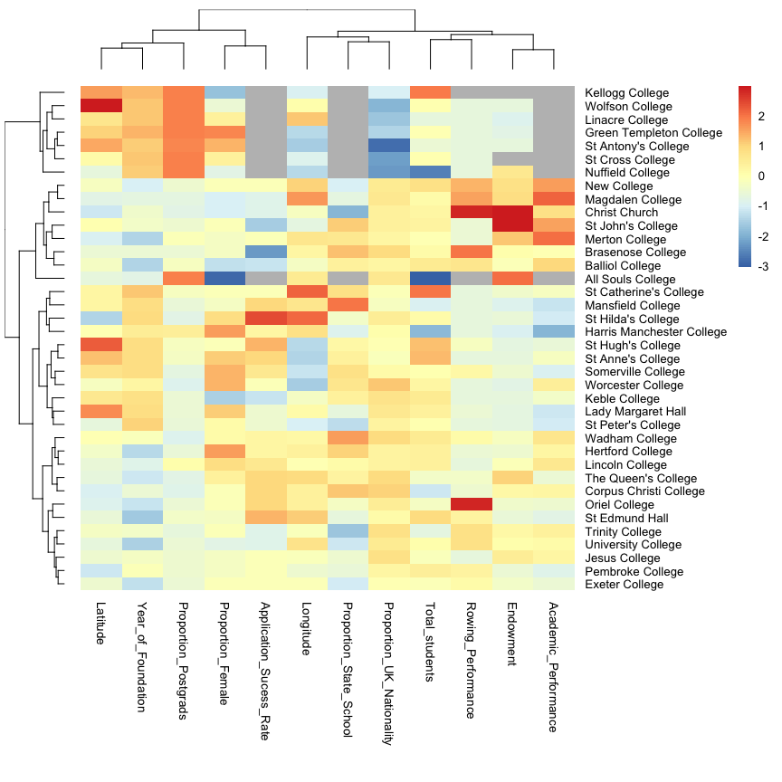
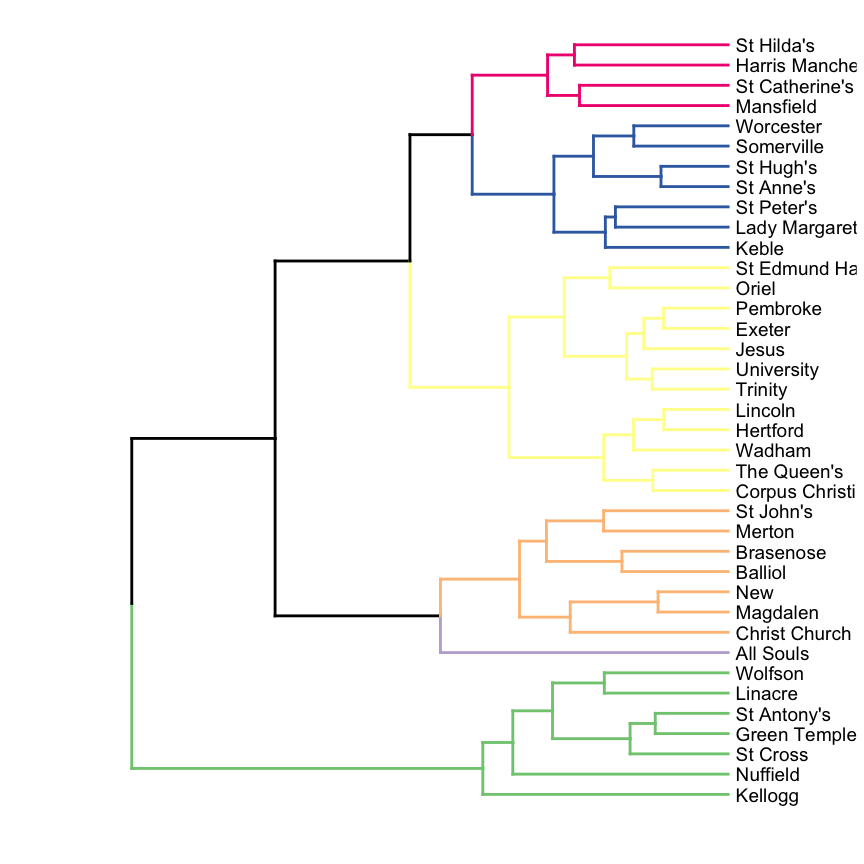
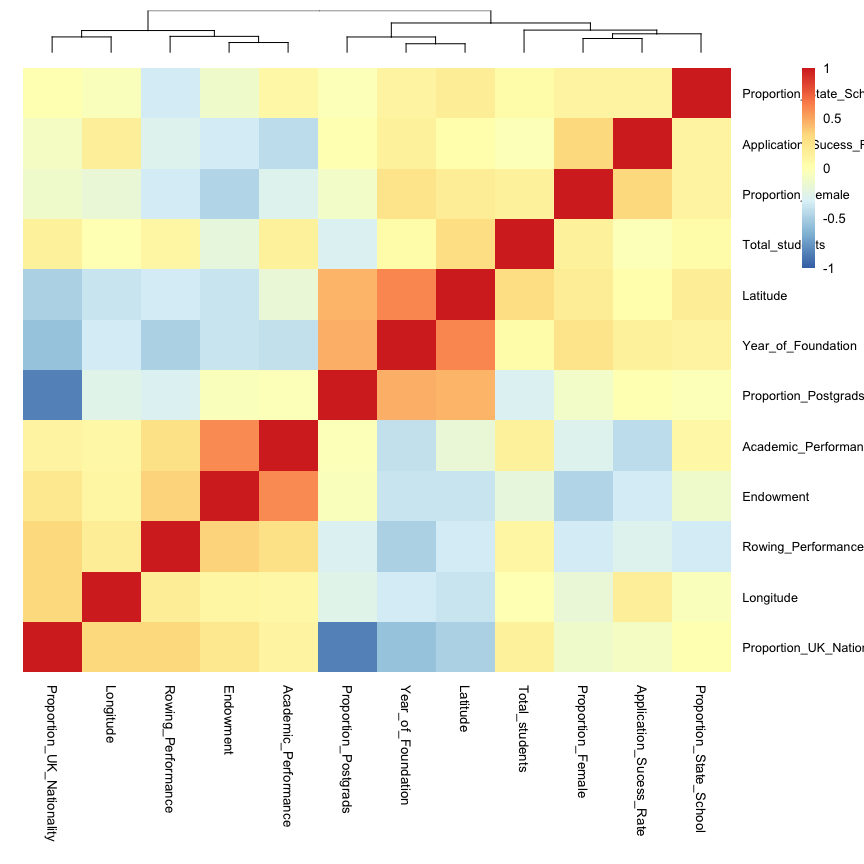
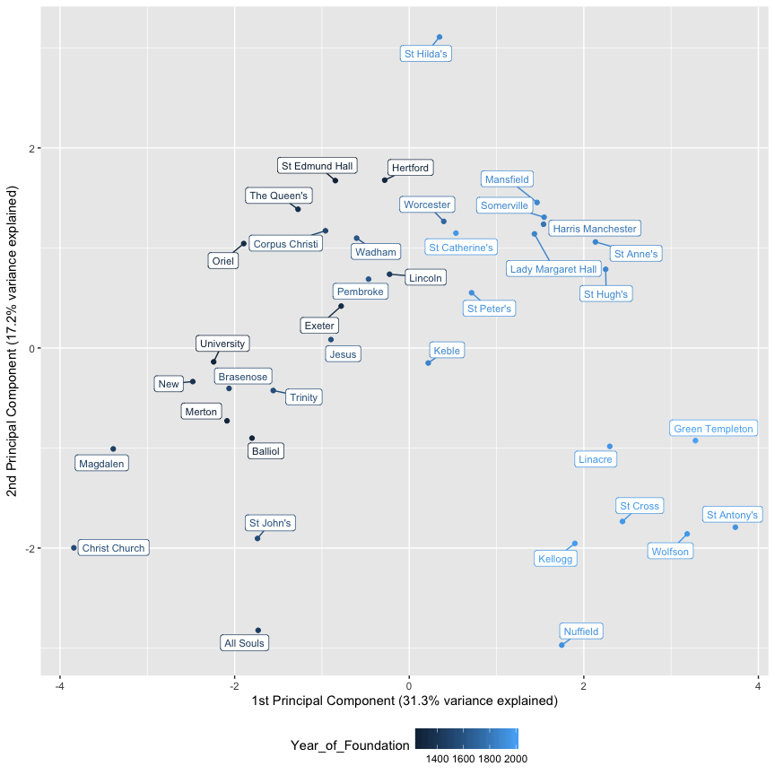
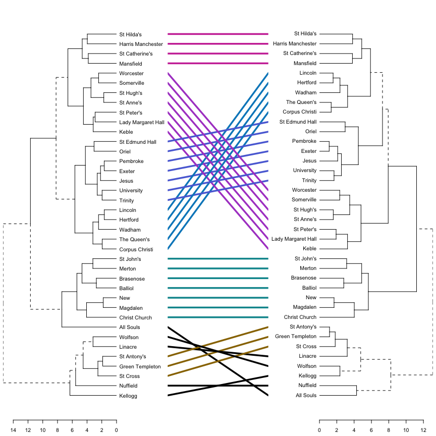
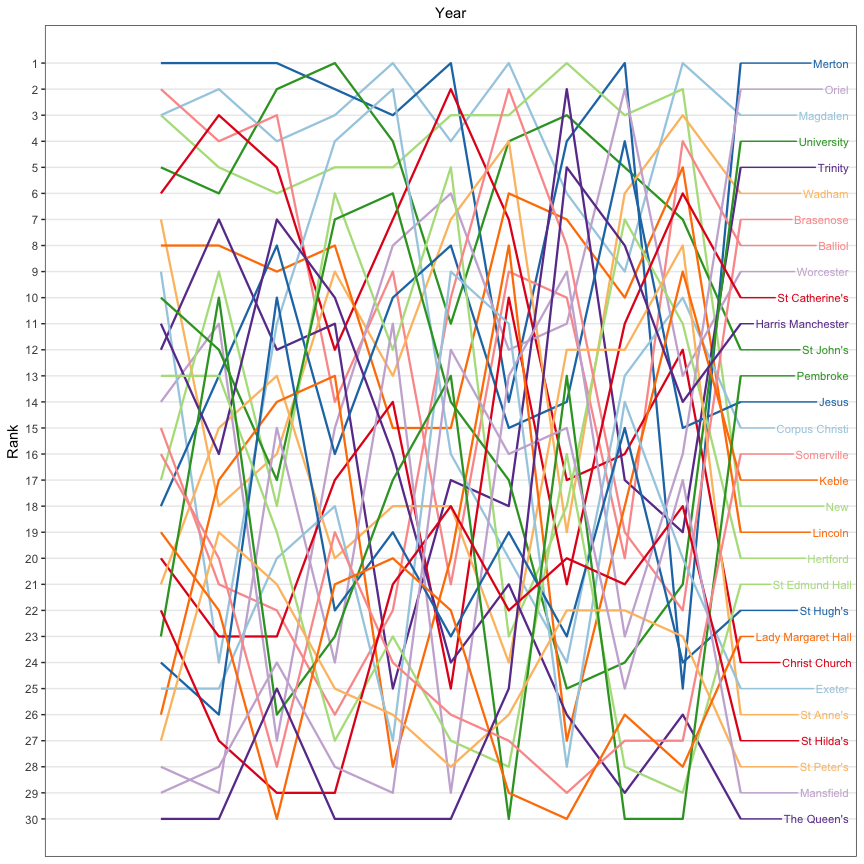
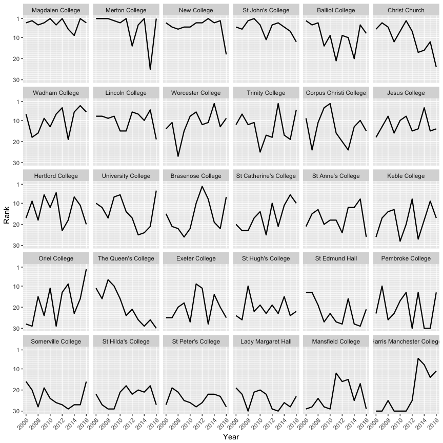

Oxford College Comparison
================

Oxford University is made up of 38 self governing colleges (and 6 Permanent Private Halls). A college is where students live, eat, and attend tutorials (small group teaching). Each college has its own character and it can be quite bewildering to get a feel for what each college is like in order to choose which one to apply to without actually studying there. This analysis uses basic clustering and dimensionality reduction techniques to group together similar colleges and provide a high level overview of their characteristics. Code for this analysis can be found in the [.Rmd file](Oxford_Colleges.Rmd).

First let's do a hierarchical clustering and display it as a heat map. You can see the features I selected as columns (academic performance is the mean norrington score, and rowing performance is the number of headships in summer eights regatta). There is quite a good clustering of similar colleges (postgraduate colleges are together, prestigious colleges are together etc.).

Let's take a closer look at the dendrogram on the left which provides a sort of 'family tree' of the colleges showing which colleges are closely 'related' i.e. have similar characteristics. The first split is between the graduate only colleges (green) and the rest. Then in orange and purple we have the group of colleges generally considered the most prestigious (old, large endowment, pretty architecture). All Souls is an outlier in that it has only 6 graduate humanities students in the whole college, but it is very prestigious and so clusters better with the mixed undergraduate-graduate colleges in orange rather than the other graduate only colleges. In blue and pink are the most relaxed colleges which are generally newer and located further from the center. In yellow are the rest of the colleges.

Many of the features used in the above analysis provide redundant information, e.g. the percentage of postgrads is highly negatively correlated with the percentage of students of UK nationality. Below is the correlation matrix for each feature.

We can use a dimensionality reduction technique called principal components analysis to collapse this dataset into a smaller number of features which enables the plotting of each college on a two dimensional plot which captures most of the variation between the colleges. In the bottom right you can see a cluster of the graduate colleges. In the bottom left are the most prestigious colleges (Christ Church, St John's, Magdalen). In the main cluster the newer and more relaxed colleges are towards the upper right.

We could also create a dendrogram ('family tree') of the colleges using the principal components but we get largely the same result. The main difference being All Souls is now grouped in with the other graduate colleges.

While I have the cleaned data I thought I could also improve the visualisation of the Norrington scores (a measure of academic performance), for which the current plot on wikipedia had so many overlapping lines it was hard to extract any information. I recreate it below:

I think a clearer way to display this data is to break the rankings down by college. You can see most of the college ranking fluctuate a lot as their scores are very similar. It should also be noted that different subjects award different proportions of degree classes and each college has a different proportion of subjects which biases the rankings.

